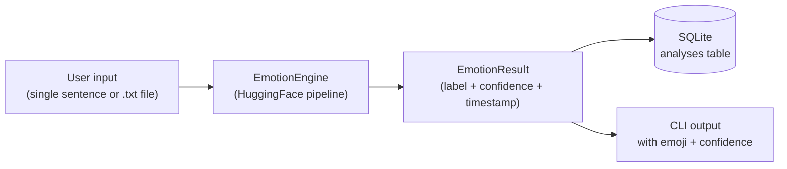

<div align="center">


**A transformer-powered CLI that reads the emotion behind text — joy, anger, fear, sadness, disgust, surprise, or neutral — with confidence scores, persistent history, and batch analysis.**


</div>

---

## 📋 Table of Contents

- [Overview](#-overview)
- [Features](#-features)
- [How it works](#-how-it-works)
- [Project structure](#-project-structure)
- [Setup](#-setup)
- [Usage](#-usage)
- [Model card](#-model-card)
- [Testing](#-testing)
- [Roadmap](#-roadmap)

---

## 🔍 Overview

Most "emotion detection" beginner projects just check if a sentence has more positive or negative words — that tells you *polarity*, not *emotion*. This project instead runs text through a pretrained transformer fine-tuned specifically for emotion classification, so "I'm furious" and "I'm terrified" don't both just get labeled "negative" — they're correctly identified as **anger** and **fear**.

Every analysis is persisted to a local database, so the tool builds a history you can query — recent analyses, most common emotion, and batch runs over whole files.

<div align="center">


</div>

## ✨ Features

| | |
|---|---|
| 🎯 **7-class emotion detection** | joy, sadness, anger, fear, disgust, surprise, neutral — not just positive/negative |
| 📊 **Confidence scores** | every prediction comes with a probability, not just a label |
| 💾 **Persistent history** | SQLite-backed; query your last N analyses or your most frequent emotion |
| 📁 **Batch mode** | point it at a `.txt` file and analyze every line in one pass |
| 🧪 **Fully tested** | `pytest` suite covering the engine, storage layer, and data models, with the ML model mocked so tests run in milliseconds |
| 🏗️ **Modular architecture** | clean separation between the model wrapper, persistence layer, data model, and CLI |

## ⚙️ How it works



1. **Input** — a sentence typed interactively, or a `.txt` file of sentences via `:batch`
2. **Inference** — `emotion_engine.py` runs the text through a pretrained DistilRoBERTa model fine-tuned for emotion classification
3. **Structuring** — the raw model output is wrapped into a validated `EmotionResult` object (`models.py`)
4. **Persistence** — every result is saved to a local SQLite database (`storage.py`) for later querying
5. **Output** — the CLI (`cli.py`) prints the emotion with an emoji and confidence percentage

## 📁 Project structure

```
emotion-detection-ai/
├── main.py               # entry point
├── cli.py                # interactive CLI: single, batch, history, stats
├── emotion_engine.py      # wraps the HuggingFace transformer pipeline
├── models.py              # EmotionResult data model, with validation
├── storage.py              # SQLite persistence layer
├── assets/
│   └── banner.svg          # README banner
├── tests/
│   ├── test_emotion_engine.py   # mocked-pipeline tests
│   ├── test_models.py
│   └── test_storage.py
├── sample_texts.txt        # demo file for batch mode
├── requirements.txt
└── .gitignore
```

## 🚀 Setup

```bash
git clone https://github.com/ananyaacodes/emotion-detection-ai.git
cd emotion-detection-ai
pip install -r requirements.txt
python main.py
```

> **First run note:** downloads the emotion model (~330MB) from Hugging Face, so it needs an internet connection once. After that, it's cached locally on disk and runs fully offline.

## 💻 Usage

```
============================================
   Emotion Detection AI
   Type a sentence to analyze its emotion.
   Commands: :history  :stats  :batch <file>  :quit
============================================
> I just got the internship offer!
  -> joy 🙂  (confidence: 94%)

> :history
Last 1 analyses:
  [2026-07-04T12:03:11] 'I just got the internship offer!' -> joy (94%)

> :stats
Total analyses: 1
Most common emotion: joy

> :batch sample_texts.txt
  [2026-07-04T12:04:02] 'I just got the internship offer!' -> joy (94%)
  [2026-07-04T12:04:02] 'I can't believe my flight got cancelled again.' -> anger (81%)
  [2026-07-04T12:04:02] 'This spider crawling on my desk is terrifying.' -> fear (97%)
  Analyzed 5 lines from sample_texts.txt.

> :quit
Goodbye!
```

## 🤖 Model card

| | |
|---|---|
| **Model** | [`j-hartmann/emotion-english-distilroberta-base`](https://huggingface.co/j-hartmann/emotion-english-distilroberta-base) |
| **Architecture** | DistilRoBERTa (distilled RoBERTa-base) |
| **Task** | Single-label text classification |
| **Labels** | anger, disgust, fear, joy, neutral, sadness, surprise |
| **Language** | English |

The model is loaded lazily on first use via HuggingFace's `pipeline()` API, so importing this project's modules doesn't require `torch`/`transformers` to be installed — only running actual inference does. This keeps the test suite fast and dependency-light.

## 🧪 Testing

```bash
pytest tests/ -v
```

The test suite mocks the transformer pipeline directly (no model download needed), covering:
- Input validation on `EmotionResult` (empty text, out-of-range confidence)
- SQLite persistence — save, recent history, most-common-emotion, clearing
- Engine behavior — single and batch analysis, error handling when `transformers` isn't installed

## 🗺️ Roadmap

- [ ] Simple web UI (Streamlit or Flask) as an alternative to the CLI
- [ ] Multi-language emotion detection
- [ ] Visualization of emotion trends over time (charts from history)
- [ ] Export history to CSV/JSON

---
